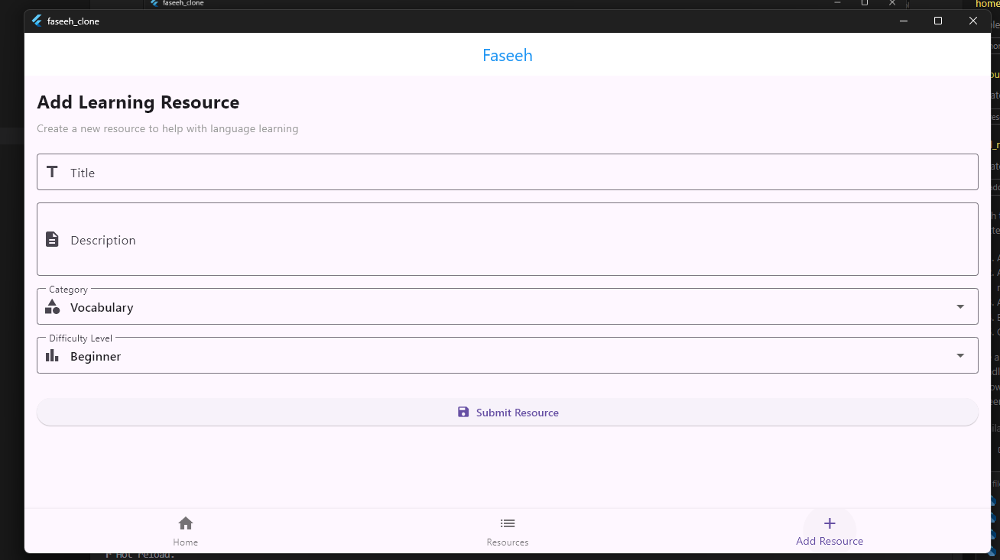

# Faseeh - Application d'Apprentissage des Langues

## Résumé Académique

Cette documentation présente _Faseeh_, une application mobile d'apprentissage des langues développée avec Flutter. Ce projet s'inscrit dans une démarche de conception d'interfaces utilisateur minimalistes et efficaces pour l'apprentissage linguistique assisté par technologie mobile.

## Table des Matières

1. [Introduction et Objectifs Pédagogiques](#introduction-et-objectifs-pédagogiques)
2. [Architecture Technique](#architecture-technique)
3. [Fonctionnalités Implémentées](#fonctionnalités-implémentées)
4. [Structure du Projet](#structure-du-projet)
5. [Méthodologie de Développement](#méthodologie-de-développement)
6. [Analyse des Résultats](#analyse-des-résultats)
7. [Conclusion et Perspectives](#conclusion-et-perspectives)

## Introduction et Objectifs Pédagogiques

_Faseeh_ a été conçu comme une plateforme d'apprentissage linguistique intuitive, s'appuyant sur les principes de conception d'interface utilisateur modernes. Ce projet vise à démontrer l'application pratique des connaissances en développement mobile Flutter, en respectant les meilleures pratiques d'architecture logicielle et d'expérience utilisateur.

Les objectifs pédagogiques principaux incluent:

- L'implémentation d'une navigation multi-écrans fluide
- La conception d'interfaces réactives avec Material Design
- La modélisation de données et leur représentation visuelle
- La gestion d'états dans une application Flutter

## Architecture Technique

Cette application est développée avec le framework Flutter, utilisant le langage Dart. Le projet respecte une architecture claire séparant les préoccupations:

- **Modèles de données**: Encapsulation des structures de données pour les ressources d'apprentissage
- **Composants d'interface**: Widgets personnalisés réutilisables
- **Écrans applicatifs**: Pages principales organisées logiquement
- **Navigation**: Système de routage entre les différentes fonctionnalités

L'architecture implémente le modèle de conception State Management de Flutter, permettant une séparation efficace entre la logique métier et la présentation.

## Fonctionnalités Implémentées

1. **Page d'Accueil**

   - Présentation des fonctionnalités principales
   - Interface utilisateur épurée avec navigation intuitive
   - Widgets interactifs présentant les diverses options d'apprentissage

2. **Liste de Ressources**

   - Affichage catégorisé des matériaux d'apprentissage
   - Indication visuelle des niveaux de difficulté
   - Options d'interaction pour accéder au contenu détaillé

3. **Ajout de Ressources**

   - Formulaire structuré pour la création de nouveaux contenus
   - Validation des entrées utilisateur
   - Catégorisation par type et niveau de difficulté

4. **Navigation**
   - Barre de navigation inférieure pour un accès rapide aux fonctionnalités
   - Transitions fluides entre les différentes sections de l'application

## Structure du Projet

```
faseeh_clone/
│
├── lib/
│   ├── main.dart             # Point d'entrée de l'application
│   ├── models/               # Définitions des modèles de données
│   │   └── resource.dart     # Modèle pour les ressources d'apprentissage
│   │
│   ├── data/                 # Couche de données
│   │   └── mock_data.dart    # Données simulées pour démonstration
│   │
│   └── screens/              # Écrans principaux de l'application
│       ├── home_page.dart    # Page d'accueil
│       ├── resources_list_page.dart  # Liste des ressources
│       └── add_resource_page.dart    # Formulaire d'ajout
│
└── android/                  # Configuration spécifique à Android
    └── build.gradle.kts      # Script de construction Kotlin
```

## Méthodologie de Développement

Le développement a suivi une approche itérative centrée sur l'utilisateur:

1. **Phase de conception**: Élaboration des maquettes d'interface et définition des cas d'utilisation
2. **Implémentation modulaire**: Développement progressif des composants individuels
3. **Intégration**: Assemblage des différents modules en une expérience cohérente
4. **Optimisation**: Affinage de l'expérience utilisateur et des performances

Les principes de développement incluent:

- Utilisation appropriée des widgets stateless et stateful
- Séparation des préoccupations dans l'architecture
- Conception responsive adaptée aux différents facteurs de forme

## Analyse des Résultats

L'application démontre une implémentation réussie d'un système d'apprentissage linguistique avec:

- **Interface utilisateur cohérente**: Utilisation uniforme des composants Material Design
- **Navigation intuitive**: Parcours utilisateur logique entre les différentes fonctionnalités
- **Présentation claire des données**: Affichage structuré des ressources d'apprentissage
- **Extensibilité**: Architecture permettant l'ajout futur de fonctionnalités avancées

## Captures d'Écran de l'Application

Voici une présentation visuelle des principales interfaces de l'application Faseeh:

### Page d'Accueil


_Interface principale présentant les fonctionnalités essentielles de l'application_

### Liste des Ressources


_Affichage des ressources d'apprentissage avec leur niveau de difficulté et catégorie_

### Formulaire d'Ajout


_Interface permettant aux utilisateurs d'ajouter de nouvelles ressources d'apprentissage_

## Conclusion et Perspectives

Ce projet illustre l'application pratique des concepts de développement mobile Flutter dans un contexte éducatif. _Faseeh_ représente une base solide pour une application d'apprentissage linguistique, avec un potentiel d'expansion significatif.

Les améliorations futures pourraient inclure:

- Intégration d'une base de données pour la persistance
- Fonctionnalités d'apprentissage interactif (quiz, exercices)
- Système d'authentification utilisateur
- Synchronisation multi-appareils

Ce projet démontre ma maîtrise des concepts fondamentaux du développement mobile moderne, depuis la conception d'interface jusqu'à l'implémentation technique.

---

© 2023 Faseeh Language Learning Application
